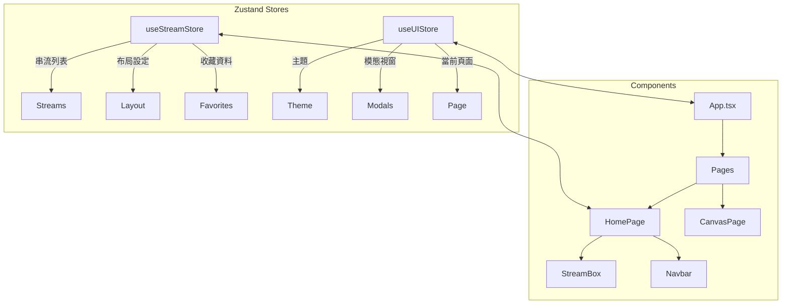

# MultiStream Hub 專案架構文件

> 📅 文件更新日期: 2026-02-08

## 📋 專案簡介

**MultiStream Hub** 是一個免費的多平台直播串流觀看工具，支援同時觀看多個 Twitch 和 YouTube 直播。

🌐 **線上版本**: [https://multistreaming.org/](https://multistreaming.org/)

### 核心特色

- **多平台串流支援** - Twitch / YouTube 同時觀看
- **多種布局模式** - 單螢幕、分割、網格、側邊聊天布局
- **聊天室整合** - Twitch & YouTube 聊天嵌入
- **收藏系統** - 多標籤管理、分類資料夾、匯入/匯出功能
- **多語言支援** - 繁中、簡中、英文、日文、韓文
- **純前端架構** - 資料儲存於瀏覽器本地，注重隱私

---

## 🛠️ 技術棧

### 前端框架與核心

| 技術 | 版本 | 用途 |
|------|------|------|
| **React** | 18.3.x | UI 框架 |
| **TypeScript** | - | 類型安全 |
| **Vite** | 6.3.x | 建構工具 & 開發伺服器 |

### 樣式系統

| 技術 | 用途 |
|------|------|
| **TailwindCSS** | 4.1.x | 原子化 CSS |
| **Shadcn/UI** | Radix UI 封裝組件庫 |
| **Radix UI** | 無樣式 UI 原語 |
| **tw-animate-css** | 動畫效果 |

### 狀態管理與資料

| 技術 | 用途 |
|------|------|
| **Zustand** | 全局狀態管理 |
| **TanStack Query** | 非同步資料快取 |
| **idb (IndexedDB)** | 本地資料持久化 |

### 國際化

| 技術 | 用途 |
|------|------|
| **i18next** | 多語言框架 |
| **react-i18next** | React 整合 |
| **i18next-browser-languagedetector** | 語言自動偵測 |

### 拖曳與布局

| 技術 | 用途 |
|------|------|
| **@dnd-kit** | 拖曳排序 |
| **@hello-pangea/dnd** | 拖曳互動 |
| **react-grid-layout** | 網格布局 |
| **react-resizable** | 可調整大小元件 |
| **react-resizable-panels** | 可調面板 |

### 其他工具

| 技術 | 用途 |
|------|------|
| **react-ga4** | Google Analytics 追蹤 |
| **react-hook-form** | 表單處理 |
| **lucide-react** | 圖示庫 |
| **sonner** | Toast 通知 |
| **uuid** | 唯一識別碼生成 |

### 測試

| 技術 | 用途 |
|------|------|
| **Vitest** | 單元測試框架 |
| **Testing Library** | React 組件測試 |
| **happy-dom / jsdom** | DOM 模擬 |

---

## 📁 專案結構

```
multi-stream/
├── 📄 index.html                 # 入口 HTML
├── 📄 package.json               # 依賴與腳本
├── 📄 vite.config.ts             # Vite 設定
├── 📄 tsconfig.json              # TypeScript 設定
├── 📄 components.json            # Shadcn/UI 設定
│
├── 📂 src/
│   ├── 📄 main.tsx               # 應用入口點
│   ├── 📄 App.tsx                # 主應用組件 (路由)
│   ├── 📄 index.css              # 全局樣式
│   │
│   ├── 📂 components/            # UI 組件
│   │   ├── 📂 ui/                # Shadcn/UI 基礎組件 (53+)
│   │   ├── 📂 Canvas/            # 畫布編輯器元件
│   │   ├── 📂 Dialogs/           # 對話框元件
│   │   ├── 📂 Layout/            # 布局元件
│   │   ├── 📂 Navigation/        # 導航元件
│   │   ├── 📂 Pages/             # 頁面元件
│   │   ├── 📄 Navbar.tsx         # 導覽列
│   │   ├── 📄 StreamBox.tsx      # 串流容器
│   │   ├── 📄 StreamChat.tsx     # 聊天室元件
│   │   └── ...
│   │
│   ├── 📂 features/              # 功能模組
│   │   ├── 📂 analytics/         # 分析追蹤
│   │   ├── 📂 backup/            # 備份匯出入
│   │   ├── 📂 favorites/         # 收藏管理 (22 檔案)
│   │   ├── 📂 feedback/          # 意見回饋
│   │   └── 📂 twitch/            # Twitch API 整合
│   │
│   ├── 📂 hooks/                 # 自定義 Hooks (13)
│   │   ├── 📄 useRouter.ts       # 前端路由
│   │   ├── 📄 useHotkeys.ts      # 快捷鍵
│   │   ├── 📄 useTwitchAuth.ts   # Twitch OAuth
│   │   ├── 📄 useYouTubeRisk.ts  # YouTube 風險提示
│   │   └── ...
│   │
│   ├── 📂 store/                 # Zustand 狀態管理
│   │   ├── 📄 useStreamStore.ts  # 串流狀態 (主要 Store)
│   │   ├── 📄 useUIStore.ts      # UI 狀態
│   │   └── 📄 playerStore.ts     # 播放器狀態
│   │
│   ├── 📂 i18n/                  # 國際化
│   │   ├── 📄 i18n.ts            # i18next 設定
│   │   └── 📂 locales/           # 語言檔 (en, zh-TW, zh-CN, ja, ko)
│   │
│   ├── 📂 utils/                 # 工具函數 (23)
│   └── 📂 types/                 # TypeScript 類型定義
│
├── 📂 functions/                 # Cloudflare Workers (Serverless)
│   └── 📂 api/                   # API 端點
│
├── 📂 scripts/                   # 建構腳本
├── 📂 tests/                     # 測試檔案
└── 📂 build/                     # 建構產出
```

---

## 🔀 頁面路由

| 路徑 | 頁面 | 說明 |
|------|------|------|
| `/` | LandingPage | 首頁 (產品介紹) |
| `/tool` | HomePage | 主工具頁面 |
| `/canvas` | CanvasPage | 畫布編輯器 |
| `/instructions` | InstructionsPage | 使用教學 |
| `/about` | AboutPage | 關於我們 |
| `/privacy` | PrivacyPage | 隱私權政策 |
| `/faq` | FAQPage | 常見問題 |

---

## 🏗️ 架構設計

### 狀態管理架構



### 資料持久化

- **IndexedDB (idb)**: 收藏資料、使用者設定
- **LocalStorage**: 主題偏好、語言設定
- **SessionStorage**: 暫存狀態

---

## 🚀 部署

### 推薦平台: Cloudflare Pages

```bash
# 建構命令
npm run build

# 產出目錄
dist/
```

### 環境變數

| 變數 | 說明 |
|------|------|
| `VITE_GA_MEASUREMENT_ID` | Google Analytics Measurement ID |

---

## 📊 效能優化

- **Code Splitting** - React.lazy() 動態載入頁面
- **Tree Shaking** - Vite 自動移除未使用程式碼
- **圖片優化** - 自動壓縮靜態資源
- **CDN 部署** - Cloudflare 全球邊緣網路

---

## 🔒 安全性

- **XSS 防護** - URL/ID 嚴格驗證
- **CSP (Content Security Policy)** - Cloudflare Headers
- **隱私優先** - 無需註冊，資料本地存儲

---

## 📝 開發指令

```bash
# 安裝依賴
npm install

# 啟動開發伺服器
npm run dev

# 執行測試
npm run test

# 建構生產版本  
npm run build
```

---

## 📚 相關文件

- [README.md](../README.md) - 專案說明
- [ToDo.md](../ToDo.md) - 待辦事項
- [PROJECT_ARCHITECTURE.md](../PROJECT_ARCHITECTURE.md) - 原架構文件

---

© 2025 Hsiung-Shao. All rights reserved.
